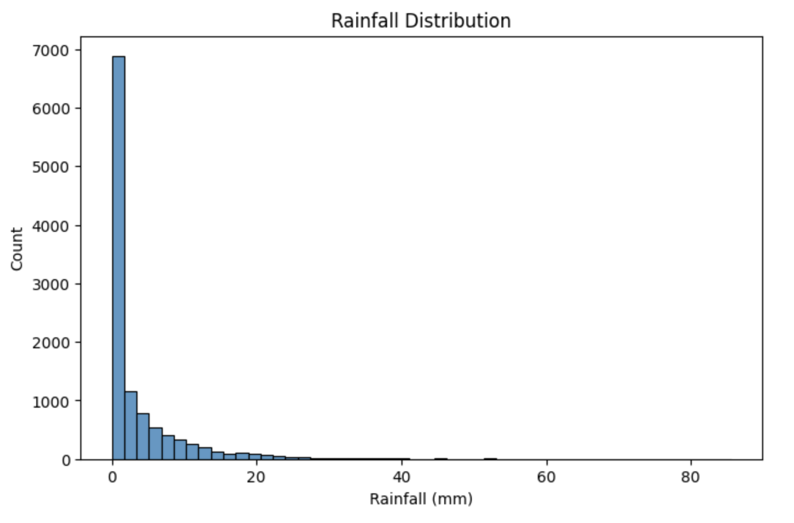
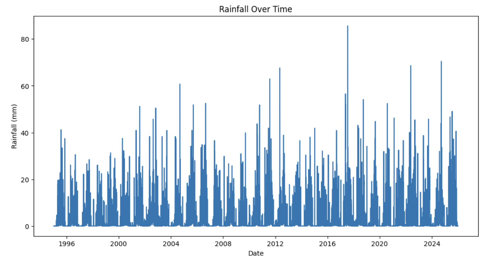
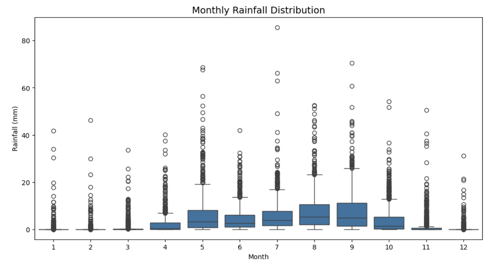
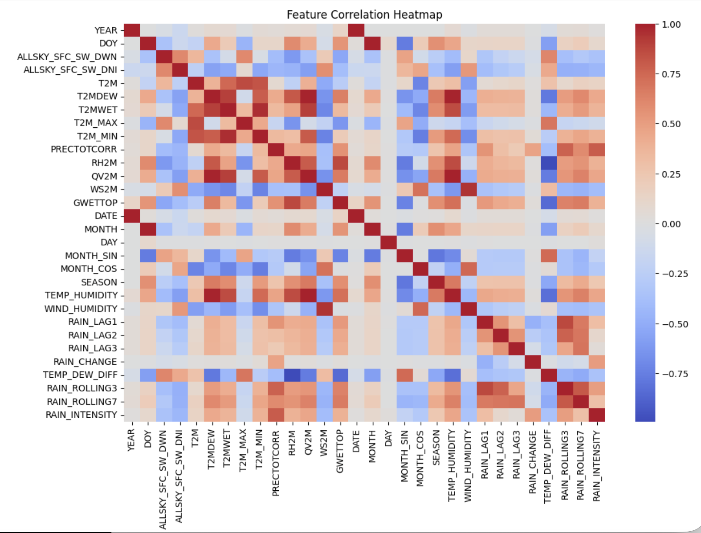
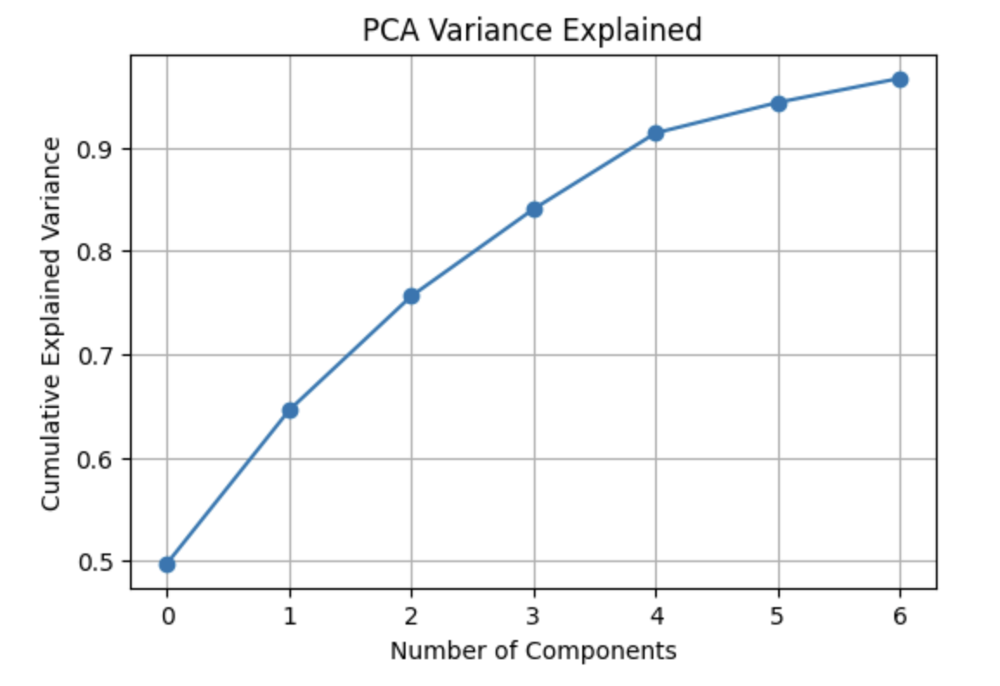
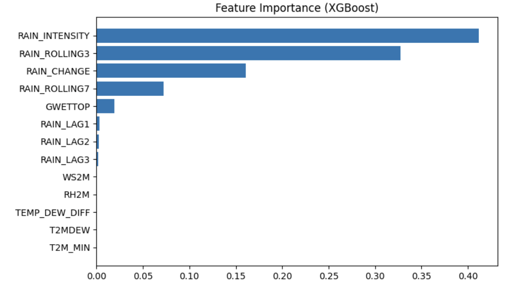

# Rainfall Prediction using Machine Learning.

An end-to-end **Machine Learning project** that predicts **daily rainfall** using historical meteorological data.

This project demonstrates a complete ML workflow including:

- Data preprocessing
- Feature engineering
- Exploratory data analysis
- Model training
- Model evaluation
- Model comparison
- Model serialization for deployment

The goal is to learn rainfall patterns from historical weather data and generate accurate predictions.

---

# Project Objective

Accurate rainfall prediction is critical for:

- Agriculture planning
- Water resource management
- Flood monitoring
- Drought prediction
- Climate research

This project builds a machine learning model that learns rainfall patterns from historical meteorological observations and predicts rainfall based on weather conditions.

---

# Dataset

The dataset contains daily meteorological observations such as:

- Temperature
- Humidity
- Solar Radiation
- Wind Speed
- Soil Moisture
- Dew Point
- Precipitation

### Target Variable

`PRECTOTCORR` → Daily rainfall (mm)

---

# Machine Learning Pipeline
Raw Dataset
↓
Data Cleaning
↓
Feature Engineering
↓
Exploratory Data Analysis
↓
Feature Selection
↓
Model Training
↓
Model Evaluation
↓
Best Model Selection
↓
Prediction (2021–2025)
↓
Model Serialization

---

# Data Preprocessing

The preprocessing stage prepares the dataset for machine learning.

Steps performed:

- Replaced missing values (`-999`) with `NaN`
- Applied **linear interpolation** for missing values
- Used **forward fill and backward fill** to maintain time continuity
- Removed invalid rainfall observations
- Created time-based features from **year and day-of-year**

This ensures the dataset remains **consistent and usable for time-series modeling**.

---

# Feature Engineering

Feature engineering was used to capture rainfall trends and temporal dependencies.

### Lag Features

Rainfall in previous days often influences future rainfall.

- `RAIN_LAG1`
- `RAIN_LAG2`
- `RAIN_LAG3`

### Rolling Window Features

- `RAIN_ROLLING3`
- `RAIN_ROLLING7`

### Weather Interaction Features

- `RAIN_CHANGE`
- `RAIN_INTENSITY`
- `TEMP_DEW_DIFF`

These features allow the model to capture **short-term weather patterns and interactions between meteorological variables**.

---

# Exploratory Data Analysis

## Rainfall Distribution



## Rainfall Over Time



## Monthly Rainfall Distribution



## Feature Correlation



---

# Dimensionality Reduction

Principal Component Analysis (PCA) was applied to analyze variance contribution.



More than **95% of the dataset variance** was preserved using a reduced number of principal components.

---

# Model Training

Multiple machine learning algorithms were trained and evaluated:

- Linear Regression
- Decision Tree Regressor
- Random Forest Regressor
- Gradient Boosting Regressor
- XGBoost Regressor
- LightGBM Regressor
- Support Vector Regressor

---

# Model Comparison

.png)

Models were evaluated using:

- R² Score
- RMSE
- MAE
- MSE

---

# Best Performing Model

**XGBoost Regressor** achieved the best performance.

### Key advantages

- Lowest RMSE
- Strong generalization capability
- Effective handling of nonlinear relationships
- High performance on structured tabular data

---

# Model Evaluation

.png)

The predicted rainfall values closely follow the actual observations, indicating strong model performance.

Residual analysis shows **minimal systematic prediction bias**.

---

# Feature Importance



Important predictors include:

- Humidity
- Soil Moisture
- Dew Temperature
- Recent Rainfall History

---

# Future Prediction

The trained model was used to generate rainfall predictions for **2021–2025**.

.png)

Predictions were compared with observed rainfall values to evaluate generalization performance.

---

# Model Deployment

The trained model was serialized using **Pickle** for fast inference.

rainfall_prediction_model.pkl

### Example Usage

```python
import pickle
import numpy as np

model = pickle.load(open("rainfall_prediction_model.pkl", "rb"))

input_features = np.array([[70,0.3,22,20,2.5,1.2,0.8,0.4,1.1,0.9,0.2,0.6,2.5]])

prediction = model.predict(input_features)

print("Predicted Rainfall:", prediction[0])
```

---

# Project Structure

```
rainfall-ml-project
│
├── data
│   └── rainfall.csv
│
├── notebooks
│   └── rainfall_analysis.ipynb
│
├── outputs
│   ├── rainfall_distribution.png
│   ├── rainfall_over_time.png
│   ├── correlation_heatmap.png
│   ├── model_comparision(RMSE).png
│   ├── feature_importance.png
│   ├── act_vs_pred(test).png
│   └── act_vs_pred(2021-2025).png
│
├── cleaned_rainfall_dataset.csv
├── rainfall_predictions_2021_2025.csv
├── rainfall_prediction_model.pkl
│
└── README.md
```

---

# Tech Stack

- Python  
- Pandas  
- NumPy  
- Scikit-learn  
- XGBoost  
- LightGBM  
- Matplotlib  
- Seaborn  

---

# Key Learnings

- Feature engineering for time-dependent tabular datasets  
- Model comparison across multiple machine learning algorithms  
- Working with meteorological datasets  
- Building end-to-end machine learning pipelines  
- Model deployment using serialized models  

---

# Future Improvements

Potential extensions include:

- Implementing deep learning models (**LSTM / RNN**)  
- Hyperparameter tuning with **Optuna**  
- Integration with real-time weather APIs  
- Deployment as a web application (**FastAPI / Streamlit**)  

---

# Author

**Srishti Sindgi**

GitHub: https://github.com/sindgisrishtis
