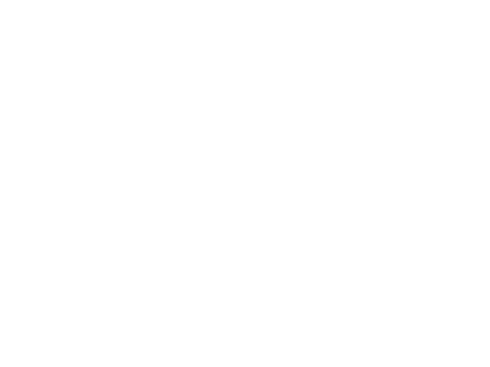

# Rainfall Prediction using Machine Learning



A machine learning project for predicting **daily rainfall levels** using meteorological data.  
This project analyzes historical weather data and builds predictive models using advanced feature engineering and multiple machine learning algorithms.

The objective is to model rainfall patterns and generate accurate predictions using supervised learning techniques.

---

# Project Overview

Rainfall prediction plays a critical role in:

- agriculture planning
- flood forecasting
- climate analysis
- water resource management

This project builds a **complete machine learning pipeline** that includes:

- Data preprocessing
- Exploratory data analysis
- Feature engineering
- Dimensionality reduction (PCA)
- Model training and comparison
- Prediction and evaluation

The dataset used is obtained from **NASA POWER climate data**.

---

# Dataset

The dataset contains **daily meteorological observations** from **1995 to 2025**.

Features include:

| Feature | Description |
|------|------|
| ALLSKY_SFC_SW_DWN | Surface shortwave radiation |
| ALLSKY_SFC_SW_DNI | Direct solar radiation |
| T2M | Temperature at 2 meters |
| T2MDEW | Dew point temperature |
| T2MWET | Wet bulb temperature |
| T2M_MAX | Maximum temperature |
| T2M_MIN | Minimum temperature |
| RH2M | Relative humidity |
| QV2M | Specific humidity |
| WS2M | Wind speed |
| GWETTOP | Soil moisture |
| PRECTOTCORR | Corrected precipitation (target variable) |

---

# Feature Engineering

To improve rainfall prediction performance, several advanced features were created:

### Lag Features
Previous rainfall values were used as predictors.

- RAIN_LAG1
- RAIN_LAG2
- RAIN_LAG3

### Rolling Rainfall Features
Captures short-term rainfall trends.

- RAIN_ROLLING3 (3-day average rainfall)
- RAIN_ROLLING7 (7-day average rainfall)

These features significantly improved the predictive performance.

---

# Exploratory Data Analysis

Key insights obtained from EDA:

- Rainfall exhibits strong **seasonal patterns**
- Monsoon months show higher precipitation variability
- Recent rainfall history is a strong predictor of future rainfall

Visualizations included:

- Monthly rainfall distribution
- Rainfall trend over time
- Correlation heatmap

---

# Machine Learning Models

Multiple regression models were trained and compared.

| Model | RMSE | MAE | R² Score |
|------|------|------|------|
| Decision Tree | 3.73 | 1.21 | 0.74 |
| Random Forest | 2.21 | 0.79 | 0.91 |
| SVR | 2.50 | 1.13 | 0.88 |
| XGBoost | **1.97** | **0.65** | **0.93** |

---

# Best Model

The **XGBoost Regressor** achieved the best performance.

**Final Performance**

```
R² Score: 0.927
RMSE: 1.97
MAE: 0.65
```

This model was selected as the final rainfall prediction model.

---

# Model Evaluation

The models were evaluated using the following metrics:

- RMSE (Root Mean Squared Error)
- MAE (Mean Absolute Error)
- R² Score

Additional evaluation techniques included:

- Actual vs Predicted rainfall visualization
- Residual error distribution analysis
- Feature importance analysis

---

# Feature Importance

Feature importance analysis revealed that rainfall prediction is strongly influenced by **recent rainfall history**.

Top contributing features:

1. RAIN_ROLLING3
2. GWETTOP
3. RAIN_LAG2
4. RAIN_LAG1

This confirms that **short-term rainfall patterns are key predictors**.

---

# Project Structure

```
rainfall-prediction-ml
│
├── data
│   └── rainfall.csv
│
├── notebooks
│   └── rainfall_analysis.ipynb
│
├── models
│   └── rainfall_model.pkl
│
├── outputs
│   ├── predictions.csv
│   ├── actual_vs_predicted.png
│   ├── residual_distribution.png
│   └── model_comparison.png
│
├── requirements.txt
├── README.md
└── .gitignore
```

---

# Results Visualization

Example model outputs include:

- Actual vs Predicted Rainfall
- Residual Error Distribution
- Model Comparison
- Rainfall Seasonality Analysis

These visualizations help understand both **model accuracy and rainfall patterns**.

---

# Installation

Clone the repository:

```bash
git clone https://github.com/yourusername/rainfall-prediction-ml.git
cd rainfall-prediction-ml
```

Install dependencies:

```bash
pip install -r requirements.txt
```

Run the notebook:

```bash
jupyter notebook
```

---

# Future Improvements

Possible extensions for this project include:

- Deep learning models (LSTM for time series forecasting)
- Hyperparameter tuning using GridSearchCV
- Deployment using FastAPI
- Real-time rainfall prediction API
- Interactive dashboard using Streamlit

---

# Technologies Used

- Python
- Pandas
- NumPy
- Scikit-learn
- XGBoost
- Matplotlib
- Seaborn
- Jupyter Notebook

---

# Author
**Srishti Sindgi**  
GitHub: https://github.com/sindgisrishtis


---